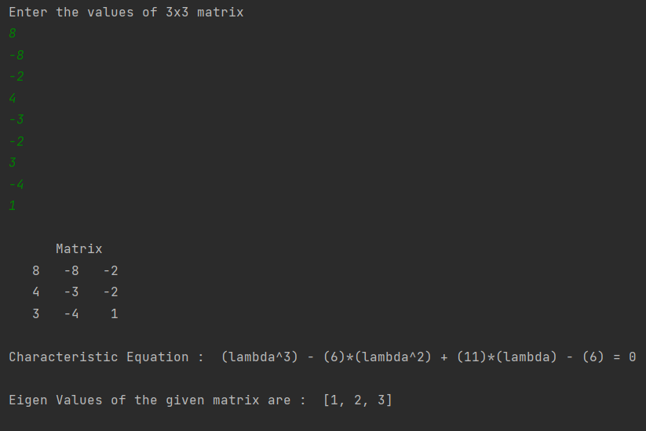
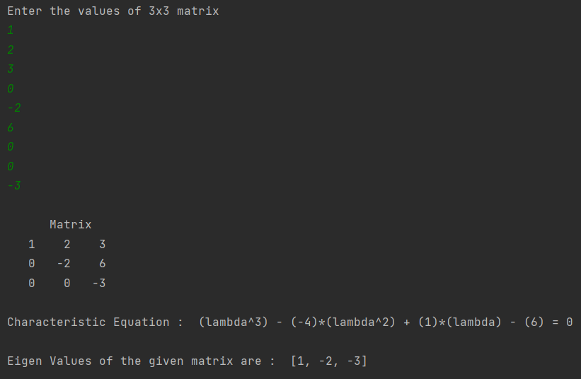

# Simple Eigen Values Calculator

This is a python script to calculate 3 eigen values of a 3x3 matrix.

### Instructions

- Copy the code and run it in cmd using `python eigen_value_calculator_3x3.py` or Run in any IDE.
- Enter 9 values  of the matrix one by one (enter the values row wise).
- Output shows the characteristic equation and eigen values (if they exist).

